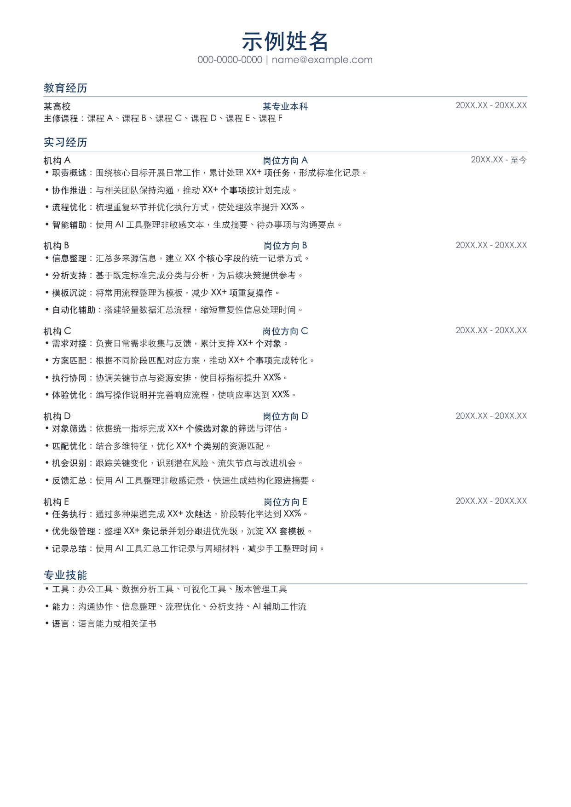

# One-page Chinese Resume

一个面向中文求职场景的配置驱动简历生成器，也是我的 AI 工作流作品集项目之一。

它将多轮人工排版反馈固化为确定性的 PDF 生成流程：只修改 JSON 内容，即可复用一页 A4、职位中轴对齐、量化成果加粗和分层间距等版式规则。



## Why this project

普通的 AI 简历生成往往每次都会重新设计，导致行距、对齐和分页不稳定。本项目把 AI 用于内容结构化与迭代，把最终排版交给可重复执行的代码，并通过渲染检查保证交付质量。

## Highlights

- 配置驱动：简历内容与排版代码分离。
- 精确中轴：所有岗位名称与姓名共用页面水平中轴。
- 结果优先：支持对数字、百分比和关键成果进行粗体强调。
- 单页约束：构建后验证 A4 页数，避免无意生成第二页。
- Codex Skill：可通过 `$one-page-cn-resume` 复用完整工作流。
- 隐私友好：姓名、联系方式、机构、时间线、岗位和工作内容均使用占位符；示例与预览不映射任何真实经历。

## Quick start

```bash
python -m venv .venv
source .venv/bin/activate
pip install -r requirements.txt
python scripts/build_resume.py data/example.resume.json --output output/example-resume.pdf
python scripts/render_check.py output/example-resume.pdf --render-dir tmp/rendered
```

macOS 会优先使用系统自带的华文黑体。其他系统可通过 `--font` 和 `--bold-font` 指定支持中文的 TTF/TTC 字体。

## Data format

数据文件包括基本信息、教育经历、实习经历和技能。需要强调的量化结果可以直接使用 `<b>...</b>`：

```json
{"label": "销售转化", "text": "推动 <b>20+ 个商机</b>进入方案阶段。"}
```

## AI workflow

1. AI 将原始经历改写成行动—方法—结果结构。
2. 人工确认事实、岗位方向和量化口径。
3. 生成器将内容排入固定的一页模板。
4. 校验脚本检查页数并输出 PNG，供最终视觉复核。

这个项目展示了我如何把一次性的 AI 对话，沉淀为可复用、可验证、可版本控制的工作流。
